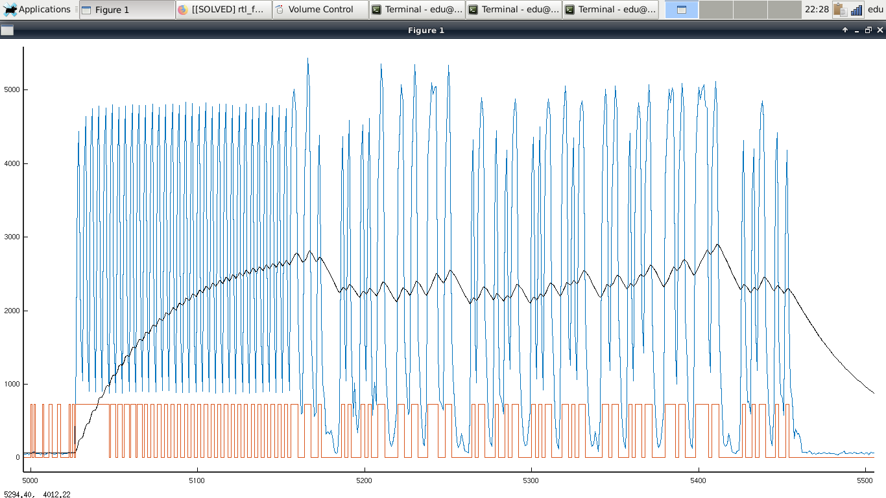

# AMSAT-GENESIS DEMODULATOR

El procesador del satélite AMSAT-GENESIS transmite tramas binarias en ASK a una velocidad de 50bps.
Exiten cuatro tipos de paquetes:

- tipo1, 048bits, respuesta con clave y valor a un telecomando
- tipo2, 216bits, telemetria frecuente (cada minuto) con tensiones e intensidades	
- tipo3, 336bits, telemetria con datos de refresco infrecuente (cada tres minutos)
- tipo4, 792bits, telemetria con datos estadisticos (cada tres minutos)

Adicionalmente, se transmite una identificacion en telegrafía.
La secuencia de transmision de paquetes es 2 3 2 4 2 cw 2 3 2 4 2 cw . . . .
El paquete dos marca el inicio del minuto.

## FORMATO DEL PAQUETE

Los paquetes tienen cuatro campos,

- 64b preambulo 1010101010.....1010
- 08b sincronia 11001100
- 02b tipo paquete
- 04b direccion
- 02b numero secuencia
- XXb datos
- 16b suma de comprobacion

Preambulo es 0x55555555 y sincronia 0xAA
Tipo de paquete es 1,2,3,4. 
Direccion identifica al satélite que esta transmitiendo: 2=AM2SAT/GENESIS-L 3=AM3SAT/GENESIS-N 
Numero de secuencia es un contador secuencial de paquete transmitido modulo 2.
La estructura detallada del campo de datos esta descrito con detalle en la hoja de calculo adjunta.

### ORDEN

Se transmite a)primero el bit de menor peso LSB de cada byte, y 
b)primero el byte de menor peso en palabras de 10..32bits.

## CODIFICACION

### ALEATORIZADOR

Para evitar el estropicio que una secuencia de 00000 produce en el receptor,
se ha introducido un aleatorizador con el polinomio g(x)=1+X^12+X^17 

### CRC

Sobre el paquete recibido, se realiza una suma de comprobacion basada en un CRC de 16 bits definido por el
polinomio g(x)=x^16+x^12+x^5+1. Si la suma falla, el paquete se descarta

### FEC

El balance de enlace preve un balance de enlace suficiente, por lo que no se
introduce redundancia, lo que a la vez, permite un uso eficiente del tiempo y energia.

# DEMODULADOR

La rutina demoduladora espera un fichero denominado AUDIO.WAV
muestreado a 8ksps, un canal, 16bits

Un filtro FIR reduce el ruido seleccionando un ancho de banda entre 500-2500Hz.

El demodulador toma bloques de 80 muestras del ADC, a un ritmo de 100 veces por
segundo, y calcula el valor RMS del bloque de muestras. La figura muestra
como el preambulo ajusta el valor medio.

Un bit slicer compara cada valor RMS con el valor promedio y genera uno/cero.

A continuación se verifica la existencia de un paquete de 50bits en los ultimos
100bits observando las posiciones pares o impares, comprobando a)byte de
sincronia, 2)crc válido.

Finalmente, con el paquete recibido, se desaletoriza, se desensambla y 
cada una de los campos de la estructura se convierte a valores físicos.

# SOFTWARE

Escrito en ANSIC, no se requiere ninguna libreria especial. Licencia GPL3

make
wine tlmrx.exe

Para decodificar en tiempo real es necesario calcular y compensar el efecto
doppler. GPREDICT y GQRX permiten realizar esta operación.

20200114, rev21

73 eduardo, ea3ghs

